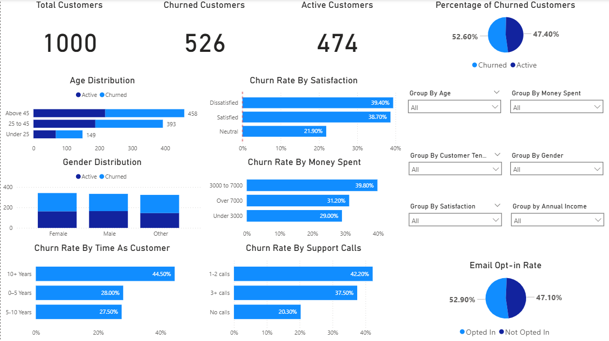

# Customer Churn Analysis Dashboard 📊

## Overview
This project analyzes customer churn using SQL and Power BI.  
The goal is to identify factors influencing churn (customer age, gender, satisfaction, support calls, money spent, etc.) and visualize insights in an interactive dashboard.

## Tools Used
- **SQL** → Data cleaning and feature engineering  
- **Power BI** → Dashboard design and visualization  

## Dataset
- [Kaggle Customer Churn Dataset](https://www.kaggle.com/datasets/hassaneskikri/online-retail-customer-churn-dataset)
- Columns engineered:  
  - `AgeGroup` → Age buckets (Under 25, 25–45, Above 45)  
  - `SupportCallsGroup` → (0 calls, 1–2 calls, 3+ calls)  
  - `TenureGroup` → Customer length (0–5 yrs, 5–10 yrs, 10+ yrs)  
  - `IncomeGroup`, `OptInStatus`,  

## Dashboard Preview


## Key Insights
- **52.6% of customers churned** (2x industry avg of 25%)  
- Customers **with more support calls churn more often**.  
- **Older customers (45+) churn less** compared to younger groups.  
- **Dissatisfied customers churned nearly 40% of the time**.  
- **Email opt-in customers churn slightly less**, suggesting engagement helps retention.
- **Long-term customers (10+ years) have highest churn**


## Actionable Insights
- **Contact 200+ dissatisfied customers**
- **Loyalty program for 10+ year customer**
- **Email opt-in campaign (47% not receiving emails)**
- **Investigate why long term customers are churning the most**

## How to Run
1. Clone this repo:  
   ```bash
   git clone https://github.com/hugofajardo11/customer-churn-dashboard.git
